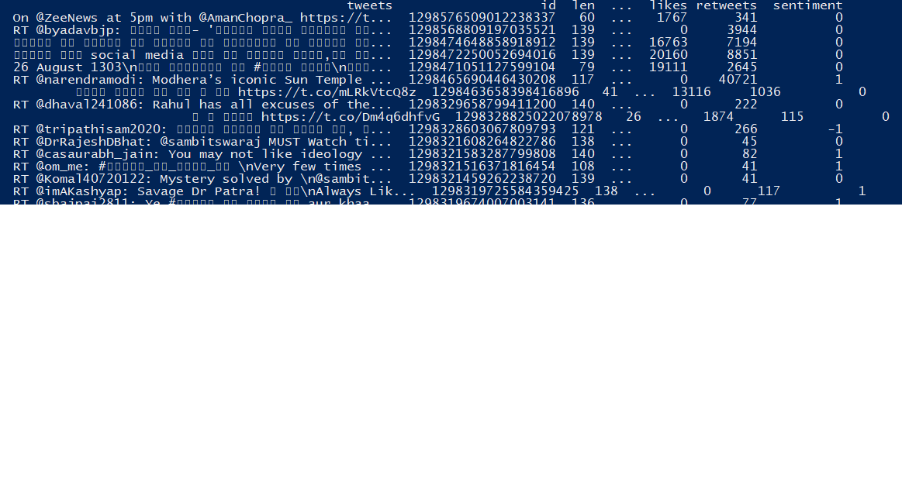

# Twitter-Sentiment-Analysis

1) The application uses Twitter API to scrape tweets of user specified twitter accounts to perform sentiment analysis on them

2) Sentiment analysis is done in three categories: positive sentiment, negative sentiment and neutral

3) Textblob is used in the application to perform sentiment analysis, which is a simple API for diving into common natural language processing (NLP) tasks such as part-of-speech tagging, noun phrase extraction, sentiment analysis, classification, translation, and more.

Following image shows how the sentiment analysis is done for the tweets:

# How to use

Enter the project credentials from developer portal of twitter in twitter_credentials.py and run the application
